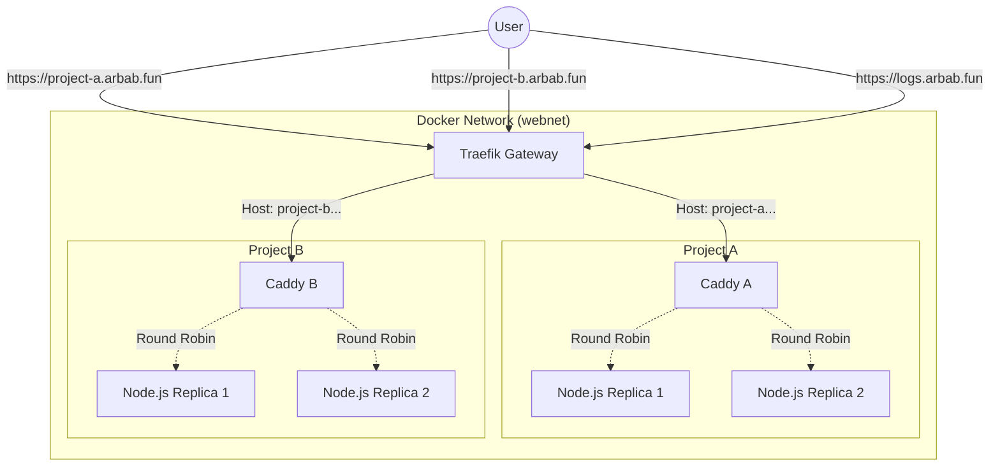

# Traefik + Caddy Scalable Deployment Demo

This repository demonstrates a scalable microservices architecture using **Traefik**, **Caddy**, and **Node.js**.

It simulates a multi-project environment where traffic is initially routed by a main API gateway (Traefik) based on the domain name, and then load-balanced across multiple backend replicas by a secondary proxy (Caddy).

## 🏗 Architecture Overview

The architecture is composed of the following layers:

1. **Edge Router / API Gateway (Traefik):** Listens on ports `80` and `443`. It looks at the incoming HTTP `Host` header to determine which project the request is intended for, and automatically handles HTTPS using Let's Encrypt.
2. **Project Proxy (Caddy):** Each project has its own dedicated Caddy server. Caddy receives traffic from Traefik and acts as an internal load balancer.
3. **Backend API (Node.js):** A simple Express-style API. Each project runs multiple identical replicas (containers) of this API. Caddy distributes incoming requests among these replicas using Round Robin.



## ⚙️ How It Works (In Depth)

### 1. Traefik (Dynamic Routing)

Traefik is configured to read Docker labels dynamically. When a new container spins up (like `caddy-a`), Traefik reads its labels:

- `traefik.http.routers.caddy-a.rule=Host('project-a.arbab.fun')`
  This tells Traefik: _"Any request matching this domain should be forwarded to this specific Caddy container."_

### 2. Caddy (Reverse Proxy & Load Balancing)

Caddy serves as the intermediary for each specific project team. Its `Caddyfile` is configured to reverse proxy traffic to the underlying Node.js applications.
Because we want Caddy to balance traffic across multiple identical backend containers, we explicitly define the backend container names in the `Caddyfile`:

```caddyfile
reverse_proxy traefik-caddy-demo-app-a-1:8080 traefik-caddy-demo-app-a-2:8080
```

Caddy automatically checks the health of these upstreams and routes traffic between them.

### 3. Node.js (The API Replicas)

The Node.js backend handles the request. To prove that load balancing is working, the API responds with its internal **Container ID** (`os.hostname()`). When making multiple requests, you will see this ID change, proving the request was handled by a different physical container.

---

## 🚀 How to Use / Getting Started

### Prerequisites

- Docker
- Docker Compose

### 1. Start the Infrastructure

Run the following command to build the images and start the containers in detached mode:

```bash
docker compose up -d --build
```

### 2. Verify Containers are Running

Ensure all 8 containers are up (1 Traefik, 2 Caddy, 4 Node.js replicas, 1 Dozzle):

```bash
docker compose ps
```

### 3. Test the Routing and Load Balancing

Because we are testing locally, we don't have real DNS records for `project-a.arbab.fun`. We simulate this by passing the `Host` header via `curl`.
Since we have configured HTTPS, we use `https://` and pass the `-k` (insecure) flag because the generated certificates are self-signed locally.

**Test Project A:**

```bash
curl -k -H "Host: project-a.arbab.fun" https://localhost
```

Run it multiple times in a loop to see the `container_id` change between the two replicas:

```bash
for i in {1..4}; do curl -k -s -H "Host: project-a.arbab.fun" https://localhost | grep container_id; done
```

_Expected Output:_

```json
  "container_id": "09ffff18652f",
  "container_id": "51d0286def0a",
  "container_id": "09ffff18652f",
  "container_id": "51d0286def0a",
```

**Test Project B:**

```bash
for i in {1..4}; do curl -k -s -H "Host: project-b.arbab.fun" https://localhost | grep container_id; done
```

---

**Test Dozzle (Logs):**

Dozzle provides a real-time web UI for viewing container logs. Since it is routed through Traefik, it's accessible at `logs.arbab.fun`.

```bash
curl -k -H "Host: logs.arbab.fun" https://localhost
```

---

## 🔬 Advanced Topics & Next Steps

This architecture provides a strong foundation. Here are advanced topics you can explore to make this production-ready:

### 1. Dynamic Scaling & Service Discovery

Currently, Caddy explicitly lists `app-a-1` and `app-a-2`. If you scale to 5 replicas using `docker compose up --scale app-a=5`, Caddy won't know about them without a config reload.

- **Action:** Integrate a service mesh or use Docker Swarm / Kubernetes. In Swarm/K8s, Caddy can simply point to the internal DNS name `tasks.app-a` (Swarm) or a Headless Service (K8s) to dynamically discover all IPs backing the service without hardcoding container names.

### 3. Health Checks & Circuit Breakers

If one Node.js container crashes, Traefik and Caddy might still route traffic to it momentarily.

- **Action:** Add Docker `healthcheck` instructions to the Node.js `Dockerfile` or `docker-compose.yml`. Caddy can also be configured with active health checks in the `Caddyfile` so it instantly removes failing backends from its rotation pool.

### 4. Rate Limiting and Middlewares

You might want to protect Project A from DDoS attacks or runaway scripts.

- **Action:** Add Traefik middlewares. You can define a RateLimit middleware in `docker-compose.yml` via labels for `caddy-a`, limiting traffic to, for instance, 100 requests per second per IP.

### 5. Centralized Logging & Metrics

With 7+ containers, checking `docker compose logs` becomes tedious.

- **Action:** Enable Traefik's Prometheus metrics endpoint. Hook up Promtail/Loki or Filebeat to collect logs from all containers and visualize them in Grafana.
